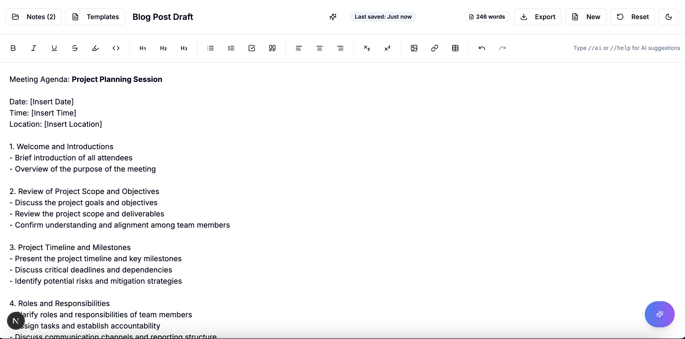
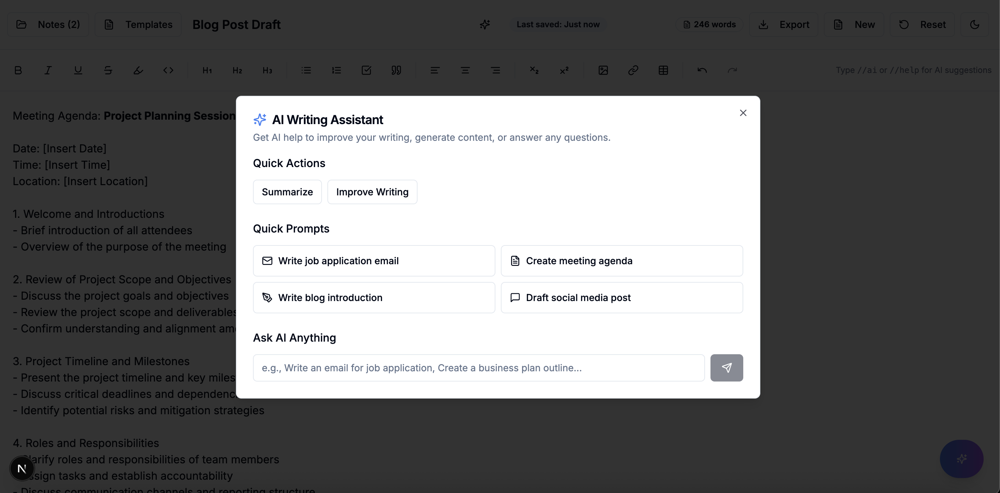

# ✨ My Notepad — The Ultimate Offline AI-Powered Notepad

A modern, offline-first, feature-rich notepad built with **Next.js**, **TypeScript**, **Tailwind CSS**, and **TipTap**, enhanced by **OpenAI-powered tools**.  
Perfect for writers, students, thinkers, and creators.




---

## 🚀 Features

- 📝 **Rich Text Editing** with:
  - Bold, italic, underline, strikethrough
  - Headings (H1–H3), bullet and ordered lists, task lists
  - Code blocks, blockquotes, alignment, subscripts/superscripts
  - Resizable tables and image upload
- 💾 **Auto-Save** to `localStorage` (offline-ready)
- 🌗 **Dark / Light Mode** with persistent setting
- 🧠 **AI Assistant** powered by OpenAI:
  - Summarize notes
  - Improve writing
  - Smart title suggestions
- 🧩 **Templates** for quick writing
- 📤 **Export Notes** as PDF, HTML, or TXT
- 🔄 **Reset Button** to clear notes
- 🧘‍♂️ **Distraction-Free Fullscreen UI**
- 📱 Fully responsive – works great on all devices

> All core features work **100% offline** after the first load.

---

## 📸 Live Demo

🔗 [View Live App](https://my-notepad-nu.vercel.app/)

---

## 🛠️ Installation

Follow these simple steps to run **My Notepad** locally.

### 📦 Requirements

Make sure you have:

- [Node.js](https://nodejs.org/en/download/) `v18+`
- [pnpm](https://pnpm.io/) (or use `npm` / `yarn`)
- An [OpenAI API key](https://platform.openai.com/account/api-keys) (optional)

---

### 🧰 Step 1: Clone the Repository

```bash
git clone https://github.com/yourusername/my-notepad.git
cd my-notepad
```
### 📥 Step 2: Install Dependencies

```bash
pnpm install
```

Or with npm:

```bash
npm install
```

Or with yarn:

```bash
yarn install
```

### 🧪 Step 3: Run the Development Server

```bash
pnpm dev
# or
npm run dev
# or
yarn dev
```

## 🔐 Environment Variables

To enable AI features and configure your app's base URL, create a `.env.local` file in the root of the project and add the following:

```env
# Your OpenAI API key (required for AI features like summarization, title generation, etc.)
OPENAI_API_KEY=your_openai_api_key_here

# Base URL of your deployed site (used for dynamic links or metadata)
NEXT_PUBLIC_BASE_URL=http://localhost:3000

```

---

Let me know if you want to add optional variables (like default templates, AI model version, or feature toggles)!

